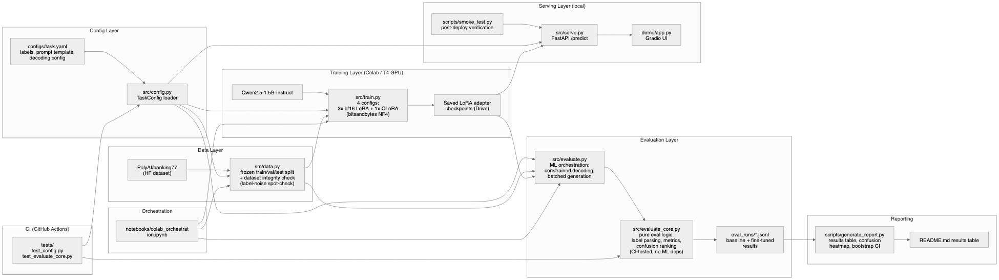

# Banking Support Intent Classifier — LoRA/QLoRA Fine-Tuning

**An evaluation-first case study: a config-driven eval harness with a frozen held-out test set, used to compare LoRA vs. QLoRA fine-tuning of a 1.5B instruction model on banking customer-support intent classification — and to catch a real label-quality flaw in the dataset before it could corrupt the results.**

## Problem

I was building an AI/ML Engineer CV for the London market (2026) and identified a gap through market research on job postings: no hands-on evidence of adapting a pretrained model's weights to a task. Fine-tuning a model is common; this project's actual differentiator is the discipline around it — a reusable, dataset-agnostic eval harness, a frozen test set that never leaks into hyperparameter selection, and a documented, evidence-based LoRA-vs-QLoRA comparison rather than a single unexamined training run. See `docs/designs/lora-finetuning-banking-intent-classifier.md` (Decision Log, 2026-09-18) for why this project leads with evaluation rigor over "I did fine-tuning" — a 2026 market check found that pitch alone is table stakes and Banking77 is a heavily reused dataset for it.

## Results

*(Populate this table by running `scripts/generate_report.py` against the real eval output — never hand-copy these numbers.)*

| Metric | Baseline (zero-shot) | Baseline (few-shot) | Fine-tuned (LoRA) | Fine-tuned (QLoRA) |
|---|---|---|---|---|
| Accuracy | — | — | — | — |
| Macro-F1 (95% CI) | — | — | — | — |
| Latency/call (CPU) | — | — | — | — |
| Peak train VRAM | n/a | n/a | — | — |

*Confusion heatmap and per-class F1 table generated at `eval_runs/report/`. Note: confusion-pair counts rest on ~40 test examples/class on average (Banking77's 3,080-example test split ÷ 77 classes) — read pair rankings as illustrative, not statistically precise.*

## Dataset Integrity Check

Banking77 has a known label-quality flaw: some labels are aggregations that include off-topic examples (e.g. `card_about_to_expire` reportedly contains ~30 examples actually about ordering a new card for China, not expiry). Before training, `src/data.py`'s split step must log the loaded per-class counts and flag any label whose examples look inconsistent on manual spot-check, so this is caught and documented here — not discovered after the fact by an interviewer who knows the dataset.

*(Fill in after running the real data-prep step: per-class counts verified, any label-noise findings, and how they were handled — exclude, note as a limitation, or re-split.)*

## The Reusable Eval Harness

`src/evaluate_core.py` is config-driven, not Banking77-specific: the label set and prompt template come from `configs/task.yaml`, and the parsing/metrics/confusion-ranking logic works for any single-label decoder-classification fine-tune. This is a deliberate design choice (see `docs/designs/`) — the eval harness itself is a reusable capability, not a one-off script for this project alone. It's also the file GitHub Actions CI actually tests (zero `torch`/`transformers` imports), separated from `evaluate.py`'s ML orchestration layer.

## Training Configuration

- **Model:** Qwen2.5-1.5B-Instruct (open-weight, small enough for plain bf16 LoRA on a free Colab T4 — 4-bit quantization is not *required* to fit this model size, which is exactly why it's worth comparing against, not assuming).
- **Method:** 3 plain bf16 LoRA configs via HF `peft` + `transformers`, plus 1 QLoRA config (4-bit NF4 base + LoRA, via `bitsandbytes`) as a direct same-task comparison arm — added specifically because 2026 job specs treat QLoRA as the default fine-tuning method, so this project shows the trade-off instead of just asserting plain LoRA is sufficient at this model size.
- **Configs compared (4):** r=8/α=16 bf16 (`q_proj,v_proj`), r=16/α=16 bf16 (`q_proj,v_proj`), r=16/α=32 bf16 (`all-linear`), r=16/α=32 QLoRA (`all-linear`, 4-bit NF4). Shared schedule: LR 1e-4 to 2e-4, 2-3 epochs, effective batch size ~16-32.
- **Decoding:** greedy (`do_sample=False`) for all scoring — deterministic, reproducible numbers.
- **Label resolution:** constrained decoding (`PrefixConstrainedLogitsProcessor`) restricts generation to the label set; exact/fuzzy-match fallback covers only constraint-initialization failure, not "malformed constrained output" (which can't occur when the constraint applies).
- **Hardware:** free-tier Google Colab T4 (16GB VRAM) for training/eval; local machine (CPU) for serving.
- **Cost:** $0 — entirely free-tier.

## What Worked / What Didn't

*(Fill in honestly after running the real experiment — this is the section that makes the before/after story credible in an interview.)*

## Architecture



Source: `diagrams/architecture.mmd` (Mermaid) — re-render with the `/diagram` skill after editing, or edit `diagrams/architecture.excalidraw` directly at excalidraw.com (note: it's a single flattened image, not per-node editable, since Mermaid subgraphs don't convert to native Excalidraw elements).

## Repo Structure

```
configs/task.yaml       # single source of truth: label list, prompt template, decoding config
src/config.py           # shared config loader
src/data.py             # dataset loading, frozen train/val/test split
src/evaluate_core.py    # pure eval logic (parsing, metrics, confusion ranking) — CI-tested
src/evaluate.py         # ML orchestration: constrained decoding, batched generation
src/train.py            # LoRA fine-tuning
src/serve.py            # FastAPI /predict endpoint
demo/app.py             # Gradio demo UI
scripts/smoke_test.py   # post-deploy verification against known examples
scripts/generate_report.py  # results table + confusion heatmap + bootstrap CI, from eval JSONL
notebooks/colab_orchestration.ipynb  # Colab notebook tying it all together
tests/                  # pytest suite for evaluate_core.py and config.py
```

## Running It

**Training (Colab):** open `notebooks/colab_orchestration.ipynb` in Colab, mount Drive, run cells top to bottom.

**Serving (local):**
```bash
pip install -r requirements.txt
python -c "from src.serve import load_model; load_model('path/to/downloaded/checkpoint')"
uvicorn src.serve:app --reload
python scripts/smoke_test.py   # verify before demoing live
python demo/app.py             # launches the Gradio UI on top of the running API
```

**Tests:**
```bash
pip install -r requirements-core.txt
pytest tests/ -v
```

## Known Limitations

- Single-run results, no seed-variation re-runs (portfolio-scope tradeoff, documented in the design doc).
- Deployment (FastAPI + demo) is the most cuttable component of this project if time runs short — see `docs/designs/` for the explicit cut-order.
- CPU-only serving is multi-second per response — a "works but slow" demo, not a production-latency claim.

## Design Process

The full design doc, CEO scope review, engineering review, and design review — including every decision and its rationale — live in `docs/designs/lora-finetuning-banking-intent-classifier.md` and the linked review artifacts. `LOGBOOK.md` is the running, chronological record of every decision, scope change, and milestone across the project's lifetime, plus a live "what's done / what's next" snapshot.
